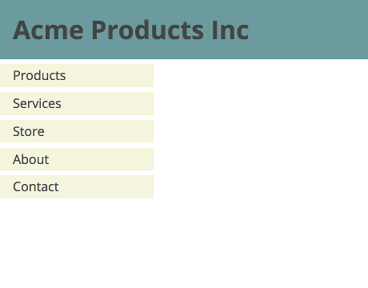

# Box Model

## Understanding the Box Model using the Developer Tools

1. In the browser's developer tools, inspect the green box below.
   (The "Inspect Element" in Chrome menu might not work:
   you'll need to open developer tools first, then select the box.)
2. Locate the box model. (In Chrome, under _Styles_ it's at the bottom; under _Computed_ it's at the top.)
3. Write down the dimensions of the following:
	- the content area
	- the padding
	- the border
	- the margin
4. In the developer tools, use the `element` rule to add a new `margin` property, setting the value to `1rem`, and check that the box model diagram changes accordingly.
5. Change the `margin` property so that all four sides have different margins.

Content

## Creating a Box

1. Create a web page containing a `
`.
1. Style the `
` so that:
	- it has a `width` and `height` of 400px and 300px respectively;
	- it has a margin of 30px;
	- it has 10px of padding.

## Using the Box Model to Implement a Design

This [HTML file](images/box-model.html) contains some markup.

1. Add an external stylesheet to the HTML file.

2. Write CSS style rules so that the HTML is displayed like this:

