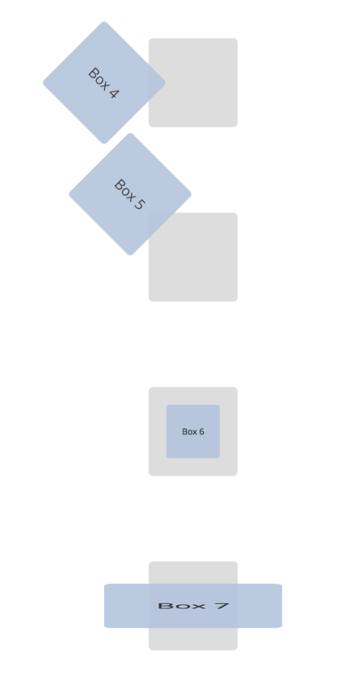
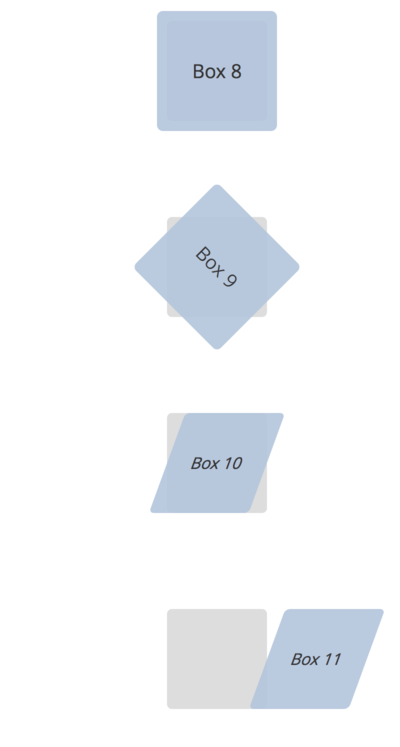
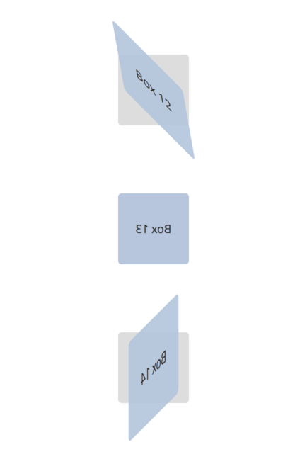
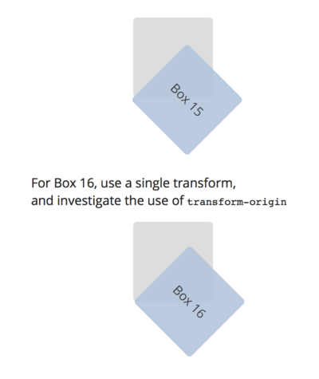

# Transforms (2D)

The following diagrams show a background box in `gray` and a front box in `lightsteelblue`. Your task is to replicate the transform shown.

## Example


I've done the first one, Box 0, for you. The HTML for Box 0 looks like this:

``` html
<div class="outer box box-0">
  <div class="inner box">
    Box 0
  </div>
</div>
```

If we add this CSS rule, we get the image shown above:

``` css
.box-0 .inner {
    transform: translate(10px);
}
```

## Exercise

Now replicate the following transforms by adding your own styles.

The [HTML](transforms-2d/transforms-2d.html) and the [CSS](transforms-2d/transforms-2d-styles.css) are in the [transforms-2d](transforms2d/) folder.









