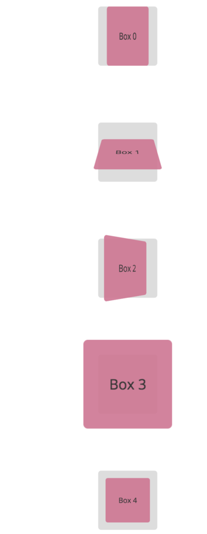
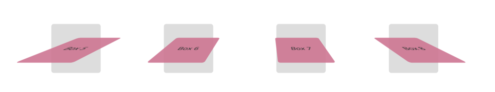

# Transforms (3D)

## Using 3D Transforms

As you've seen, 2D Transforms are performed on the XY plane. 3D Transforms extend transforms using the Z axis and use XYZ space.

- Positive Z values move _toward_ the viewer; negative Z values move away.

Perspective can be applied using the `perspective` property (eg `perspective: 600px;`). From MDN:

> The perspective CSS property determines the distance between the z=0 plane and the user in order to give to the 3D-positioned element some perspective. Each 3D element with z>0 becomes larger; each 3D-element with z<0 becomes smaller. The strength of the effect is determined by the value of this property.

Play with perspective values to find a reasonable view.

The [HTML](transforms-3d/transforms-3d.html) and the [CSS](transforms-3d/transforms-3d-styles.css) are in the [transforms-3d](transforms3d/) folder.

Now replicate the following transforms (again, I've done the first one for you as you'll see in the stylesheet):

For boxes 5-8, ensure that the `perspective` property is applied correctly.

